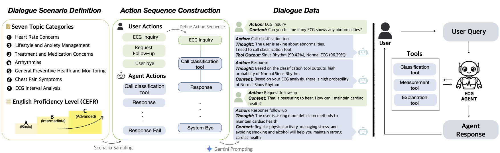

<div align="center">

<h1> ECG-Agent: On-Device Tool-Calling Agent for ECG Multi-Turn Dialogue </h1>

<h5 align="center"> 

<a href=''></a>
<a href='https://huggingface.co/gustmd0121'>

<br>

[Hyunseung Chung](https://sites.google.com/view/thschung)<sup>1</sup>,
[Jungwoo Oh](https://github.com/Jwoo5)<sup>1</sup>,
[Daeun Kyung](https://dek924.github.io/)<sup>1</sup>,
[Jiho Kim](https://jiho283.github.io/)<sup>1</sup>,
[Yeonsu Kwon](https://sites.google.com/view/yeonsukwon)<sup>1</sup>,
[Min-Gyu Kim](https://mingyuk.github.io/)<sup>2</sup>,
[Edward Choi](https://mp2893.com/)<sup>1</sup>

<sup>1</sup>KAIST <sup>2</sup>Ajou University School of Medicine

<p align="center">
    
</p>

</h5>
</div>

## Introduction

Recent advances in Multimodal Large Language Models have rapidly expanded to electrocardiograms, focusing on classification, report generation, and single-turn QA tasks. However, these models fall short in real-world scenarios, lacking multi-turn conversational ability, on-device efficiency, and precise understanding of ECG measurements such as the PQRST intervals.
To address these limitations, we introduce **ECG-Agent**, the first LLM-based tool-calling agent for multi-turn ECG dialogue. To facilitate its development and evaluation, we also present the **ECG-Multi-Turn-Dialogue (ECG-MTD) dataset**, a collection of realistic user-assistant multi-turn dialogues for diverse ECG lead configurations. We develop ECG-Agents in various sizes, from on-device capable (1B, 3B) to larger agents (8B, 32B).
Experimental results show that ECG-Agents outperform baseline ECG-LLMs in response accuracy. Furthermore, on-device agents achieve comparable performance to larger agents in various evaluations that assess response accuracy, tool-calling ability, and hallucinations, demonstrating their viability for real-world applications.

### ECG-MTD Dataset

| Type | 12-lead | Lead I | Lead II |
|------|----------|---------|---------|
| Dataset | [ECG-MTD 12-lead](https://huggingface.co/datasets/gustmd0121/12-lead-ecg-mtd-dataset) | [ECG-MTD Lead I](https://huggingface.co/datasets/gustmd0121/single-lead-I-ecg-mtd-dataset) | [ECG-MTD Lead II](https://huggingface.co/datasets/gustmd0121/single-lead-II-ecg-mtd-dataset) |
| Ground-Truth | [ECG-MTD 12-lead Ground-Truth](https://huggingface.co/datasets/gustmd0121/12-lead-ecg-mtd-dataset-gt) | [ECG-MTD Lead I Ground-Truth](https://huggingface.co/datasets/gustmd0121/single-lead-I-ecg-mtd-dataset-gt) | [ECG-MTD Lead II Ground-Truth](https://huggingface.co/datasets/gustmd0121/single-lead-II-ecg-mtd-dataset-gt) |


## Getting Started

### Classification Tool

#### 1. Pre-processing and Pretraining

For pre-processing PhysioNet2021 and pretraining W2V+CMSC+RLM, follow the instructions in:
- [Fairseq-signals repository](https://github.com/Jwoo5/fairseq-signals) (uni-modal tasks section)
- [W2V+CMSC+RLM guide](https://github.com/Jwoo5/fairseq-signals/blob/master/examples/w2v_cmsc/README.md)

#### 2. Fine-tuning a Pre-trained Model

**Step 2a:** Preprocess the PTB-XL dataset:

```bash
python src/preprocess/preprocess_ptbxl.py \
    /path/to/ptbxl/records500/ \
    --dest /path/to/output
```

**Step 2b:** Generate manifest files for fine-tuning:

```bash
python src/preprocess/manifest_ptbxl_10s.py /path/to/output
```

**Step 2c:** Fine-tune on the Cardiac Arrhythmia Classification task:

```bash
fairseq-hydra-train \
    model.model_path=/path/to/pretrained_model/checkpoints/checkpoint_last.pt \
    +task.data=/path/to/output/from/2b/ptbxl_10s_manifest \
    --config-dir examples/w2v_cmsc/config/finetuning/ecg_transformer \
    --config-name diagnosis
```

#### 3. Extract Tool Outputs

After fine-tuning, use the model to produce tool output CSV files.

**Classification** (requires model path):

```bash
python extract_tool_outputs.py \
    --tool classification \
    --ecg_dir /path/to/ecg/files \
    --model_path /path/to/checkpoint_best.pt \
    --output_dir ./results
```

**Measurements** (no model needed):

```bash
python extract_tool_outputs.py \
    --tool measurements \
    --ecg_dir /path/to/ecg/files \
    --output_dir ./results
```

**Explanations** (no model needed):
Follow the instructions in: [SpectralX repository](https://github.com/gustmd0121/Time_is_not_Enough)
---

### Fine-tuning ECG-MTD

#### 1. Fine-tune the Model

```bash
python finetune_ecg_dialogue_unsloth.py
```

#### 2. Run Inference

```bash
python inference_ecg_dialogue.py
```


